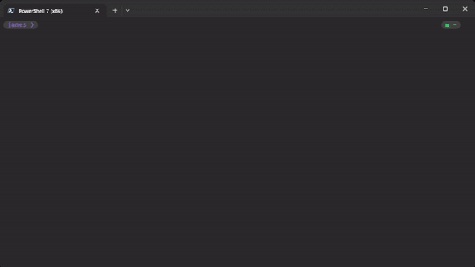

# Nodenomore

Nodenomore is a command-line interface (CLI) tool that removes node_modules directories from your computer, saving you disk space and keeping your workspace tidy.

<br>
<p align="center"></p>
<br>

## Why should you use this?

- `node_modules` directories often take up a significant amount of disk space, and they can accumulate quickly across different projects.
- Developed with ease of use in mind, while ensuring specificity in targeting only unnecessary `node_modules`.

<br>

## Install

```
npm install -g nodenomore
```

<br>

## Usage

Simply navigate to the directory where your `node_modules` are stored and type:

```
nodenomore
```

<br>

## Prerequisites

- Ensure you have Node.js installed on your computer. You can download it from Node.js official website.
- It’s advisable to have npm (Node package manager) updated to the latest version.

<br>

## Safety Measures

Nodenomore has been designed to avoid accidental deletions. It double-checks with you before removing any `node_modules` directories.

<br>

## Contributions

Contributions to Nodenomore are welcomed! Fork the repository on GitHub, make your changes, and submit a pull request.

<br>

## Support

If you encounter any issues or have questions, please open an issue on the GitHub issues page.

<br>

## License

Nodenomore is licensed under the MIT License. See the LICENSE file for more information.
